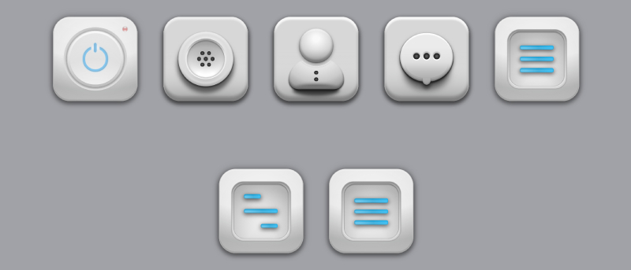

# my-button-and-icon-styles

While learning HTML CSS and the beginnings of JavaScript, I wanted to create a project in which I would add icons and buttons styled only in CSS. I hope that in the future they will be useful in creating other projects :)

## Technologies

* HTML
* CSS
* JavaScript

## Link

Here you will find a link to icons and buttons made by me:
(https://pawel-serafinko.github.io/my-button-and-icon-styles/)

### What I have learned and what obstacles I encountered

How to create the impression of a bulging or lowering? 
I had the idea to start at the bottom and add another layer inside to achieve the desired effect.
The properties of the CSS thanks to which I achieved this etect are backgrund-image and box-shadow.

Another property that became problematic for me was: filter: blur ();
It turned out that the Safari browser on MacOS reads the values in px differently than other browsers, which caused a large blur of the project. 
I have transformed the project so that I do not have to use this property.
